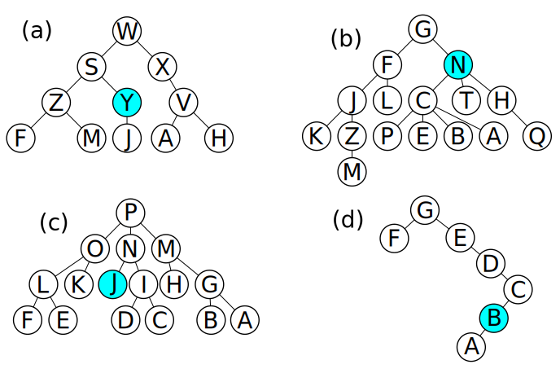
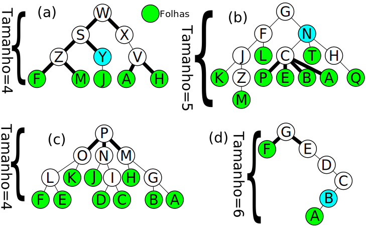
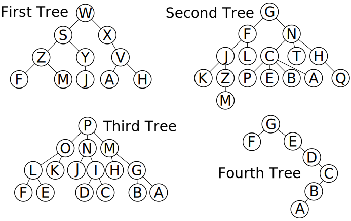

==== Autoavaliação

:img: images/arvores
:caderno: https://github.com/edusantana/mergulhando-de-cabeca-na-ead/blob/master/livro/caderno-arvore.asciidoc

.Objetivo da seção
____
Ao final desta seção você deverá ser capaz de:

*Entender* o que é uma árvore e suas características básicas e
*lembrar* dos termos técnicos em inglês, *reconhecendo* e *descrevendo*
características de árvores apresentadas; e *reconhecendo* e
*reproduzindo* os termos em inglês apresentados.

____

A proposta de verificação do objetivo da seção possui três partes,
que veremos a seguir.

===== Reconhecendo características básicas em árvores apresentadas

Para atender à primeira parte do objetivo da seção *você deverá
reconhecer as características das árvores apresentadas*. Na
<<fig_verificando_aprendizado_objetivo1>> são apresentadas quatro
árvores, com um nó em destaque em cada uma delas. As características
da primeira árvore já foram reconhecidas, na tabela. Faça o mesmo
para as demais árvores.

<<<

++++
<simpara>
<ulink url="{caderno}">
<inlinemediaobject>
<imageobject>
<imagedata fileref="images/pagina-com-atividade.svg"/>
</imageobject>
</inlinemediaobject></ulink></simpara>
++++

[[fig_verificando_aprendizado_objetivo1]]
.Árvores para serem utilizadas no reconhecimento das características

[cols="1a,1a", frame="none", grip="none"]
|====
| 
*Nó Y e Árvore (a)* + 
Nível de nó: *2* +
Pai do nó: *S* +
Filho(s) do nó: *J* +
Caminho até o nó: *WSY* +
Grau de nó: *1* +
Grau da árvore: *2* +
Altura da Árvore: *4* +
Todas as folhas: *F, M, J, A, H*
|
*Nó N na Árvore (b)* +
Nível de nó:  +
Pai do nó:  +
Filho(s) do nó:  +
Caminho até o nó: +
Grau de nó:  +
Grau da árvore: +
Altura da Árvore: +
Todas as folhas:

|
*Nó J na Árvore (c)* +
Nível de nó:  +
Pai do nó:  +
Filho(s) do nó:  +
Caminho até o nó:  +
Grau de nó:  +
Grau de árvore:  +
Altura da Árvore:  +
Todas as folhas:

|
*Nó B na Árvore (d)* +
Nível de nó:  +
Pai do nó:  +
Filho(s) do nó:  +
Caminho até o nó:  +
Grau de nó:  +
Grau de árvore:  +
Altura da Árvore:  +
Todas as folhas:

|====

<<<

.Resolução 

Para facilitar a compreensão, as folhas e os nós de maior grau foram
realçados nas árvores a seguir:

[cols="1a,1a", frame="none"]
|====
|
*Nó Y na Árvore (a)* + 
Nível de nó: 2 +
Pai do nó: S +
Filho(s) do nó: J +
Caminho até o nó: WSY +
Grau de nó: 1 +
Grau da árvore: 2 +
Altura da Árvore: 4 +
Todas as folhas: F, M, J, A, H
|
*Nó N na Árvore (b)* +
Nível de nó: 1 +
Pai do nó: G +
Filho(s) do nó: C,T,H +
Caminho até o nó: GN +
Grau de nó: 3 +
Grau de árvore: 4 (grau do nó C) +
Altura da Árvore: 5 +
Todas as folhas: K, M, L, P, E, B, A, T, Q

|
*Nó J na Árvore (c)* +
Nível de nó: 2 +
Pai do nó: N +
Filho(s) do nó: não possui filhos +
Caminho até o nó: PNJ +
Grau de nó: 0 +
Grau de árvore: 3 (grau do nó P) +
Altura da Árvore: 4 +
Todas as folhas: F, E, K, J, D, C, H, B, A

|
*Nó B na Árvore (d)* +
Nível de nó: 4 +
Pai do nó: C +
Filho(s) do nó: A +
Caminho até o nó: GEDCB +
Grau de nó: 1 +
Grau de árvore: 2 (grau do nó G) +
Altura da Árvore: 6 +
Todas as folhas: F, A

|====

[TIP]
.Feedback
====

Como você se saiu nesta atividade? O que você errou?
É comum errar as _folhas_ e o _grau das árvores_, pois requer 
pesquisar com atenção cada nó da árvore. O nível do nó e o tamanho
da árvore pode confundir um pouco, pois o nível começa a ser contando
de zero (a raiz tem nível zero), mas a altura começa a partir de um. 
Após realizar esta atividade esperamos que você sinta-se confiante 
que sabe reconhecer todos estes conteúdos.

====

<<<

===== Descrevendo as características de árvores com suas próprias palavras

++++
<simpara>
<ulink url="{caderno}">
<inlinemediaobject>
<imageobject>
<imagedata fileref="images/pagina-com-atividade.svg"/>
</imageobject>
</inlinemediaobject></ulink></simpara>
++++

Nesta segunda etapa, você deverá descrever os conceitos estudados
com suas próprias palavras.

.Conceitos estudados
____

Árvore; Nó; Aresta; Nó Raiz; Nó pai/filho; Folhas; Nível de um Nó;
Grau de Nó/Árvore; Caminho; Altura da Árvore;

____

O propósito desta atividade é proporcionar um momento de reflexão
sobre os conteúdos estudados. *Escolha dois conceitos* da lista e
descreva-os com suas *próprias palavras*:

<<<

.Resposta 

Essa atividade não possui respostas únicas, pois os entendimentos
registrados são pessoais. É importante que você tenha praticado
explicar os conceitos com suas próprias palavras, evitando reproduzir
as definições formais apresentadas. Segue exemplo de possível resposta:

.Conceito: Nó
****
Um _nó_ possui um valor, um pai único e pode ter vários ou nenhum filhos. 
****

.Conceito: Altura da Árvore
****
A altura da árvore corresponde _a quantidade de nós_ do maior caminho
da raiz a qualquer nó de sua árvore.
****

[TIP]
.Feedback
====

Esta atividade tem a finalidade de proporcionar condições para que
você _fixe os conteúdos estudados_. O rigor científico não está sendo
exigido.

Por exemplo, ao descrever o que é um *nó filho*, você pode ter 
escrito que _todos os nós abaixo de um nó são filhos dele_. Esta 
seria uma resposta perfeitamente aceitável.

Se você pulou estava atividade e foi direto para a resposta,
convido-o(a) a voltar e tentar realizá-la.

====

<<<

===== Reproduzindo os termos em inglês apresentados

++++
<simpara>
<ulink url="{caderno}">
<inlinemediaobject>
<imageobject>
<imagedata fileref="images/pagina-com-atividade.svg"/>
</imageobject>
</inlinemediaobject></ulink></simpara>
++++

image::{img}/documentacao-arvore-em-ingles.svg[]

Imagine que você está trabalhando em uma empresa de desenvolvimento
de software nacional, mas que possui uma política de documentar
os códigos fontes em inglês.

Uma tarefa de hoje consiste em documentar o funcionamento
do código de uma árvore. Junto com o(a) parceiro(a), vocês acordaram
que o seguinte texto deverá ser traduzido para compor a documentação
sobre árvores em inglês:

____

*Árvore* é uma estrutura de dados que possui muitos *nós*. Cada *nó*
possui um *valor* e pode está conectado com outros nós através de
*arestas*. Um nó pode ter muitos *filhos*, mas apenas um único *pai*.
O primeiro nó é chamado de *raiz* da árvore. E um nó sem um *filho*
é chamado de nó terminal ou *folha*. 

____

Seu(ua) parceiro(a) sabe que você precisa praticar o inglês, por isso 
ele(a) iniciou a tradução, mas deixou lacunas para você preencher.

Complete o texto a seguir com os respectivos termos em inglês para
finalizar a tradução:

____

`________________` is a data structure that has many
`__________________`. Each `________________` has a `____________` and may be
connected to others nodes through `__________________`.  A node can
have many `________________________`, but only one
`________________________`. The first node is called the
`________________` of the tree. And a node without a
`____________________` is called terminal node or `________________`.

____

TIP: Busque realizar esta atividade _mesmo se_ possuir pouco conhecimento
da língua inglesa. 

<<<

Confira sua resposta:

[quote]
_Tree_ is a data structure that has many _nodes_. Each _node_
has a _value_ and may be connected to others nodes through _edges_. 
A node can have many _children_, but only one _parent_.
The first node is called the _root_ of the tree. And a node without
a _child_ is called terminal node or _leaf_.

[TIP]
.Feedback
====

Além de reconhecer os termos técnicos em inglês é importante que você
pratique sua escrita. Esta habilidade também é necessária quando você está
escrevendo um código e precisa chamar funções escritas por terceiros.

Durante o curso é esperado que você desenvolva uma habilidade
que chamamos de _inglês técnico_. Que irá habilitá-lo a ler e escrever
documentações, em inglês, sobre os conteúdos de computação.

Se você conhecia as palavras do inglês _father_ e _son_ (pai e
filho masculino) perceberá que os termos técnicos não possuem
uma tradução literal para o português. Quando estamos falando de
árvores, o _pai_ não é _father_, mas _parent_ (que a tradução literal
equivale ao singular de _os pais_, designado para ambos os sexos) e
_filho_ é _child_ (que a tradução literal seria criança).

Como você se saiu nesta atividade? Não se preocupe se teve
dificuldades, o importante é dar passos em direção a sua formação no
inglês técnico.

====

<<<

===== Reconhecendo os termos em inglês apresentados

++++
<simpara>
<ulink url="{caderno}">
<inlinemediaobject>
<imageobject>
<imagedata fileref="images/pagina-com-atividade.svg"/>
</imageobject>
</inlinemediaobject></ulink></simpara>
++++

////
http://www.introprogramming.info/english-intro-csharp-book/read-online/chapter-17-trees-and-graphs/
https://www.princeton.edu/~achaney/tmve/wiki100k/docs/Tree_%28data_structure%29.html
http://interactivepython.org/runestone/static/pythonds/Trees/trees.html
http://interactivepython.org/runestone/static/pythonds/Trees/implementation.html
////

Utilizando as árvores da figura abaixo, verifique que você consegue
reconhecer os termos em inglês, respondendo as intruções. Algumas
respostas já foram preenchidas para facilitar o seu entendimento.

[cols="1a,1a", frame="none", grip="none"]
|====
| 
Children of node V at First Tree: *A, H* +
Children of node N at Second Tree: +
Children of node C at Last Tree:
|

Parent of node V at First Tree: *X* +
Parent of node N at Second Tree: +
Parent of node C at Last Tree:

|
Degree of node V at First Tree: *2* +
Degree of node N at Second Tree: +
Degree of node N at Third Tree: +
Degree of node C at Last Tree: 

|
Descendants of S at first tree: *Z, F, M, Y, J* +
Descendants of N at second tree: +
Descendants of M at third tree: +
Descendants of D at last tree:

|
*Path from Root to Node A* +
At first tree: *WXVA* +
At second tree: +
At last tree: 
|
*Level of Node F* +
At first tree: *3* +
At second tree: +
At last tree:  

|
*One internal Node* +
Of first tree: *X* +
Of second tree: +
Of third tree: +
Of Last tree:

|

Leaves of first tree: +
One leaf of second tree: *P* +
One leaf of third tree: +
Leaves of last tree: *A, F*
|
Root node of each tree: *W, `___`, `___`, `___`*
|
Degrees of all trees: *2, `___`, `___`, `___`*

|====

<<<

////

////

Segue as respostas e traduções das instruções.

[cols="1a,1a", frame="none", grip="none"]
|====
| 
Children of node V at First Tree: *A, H* +
_(Os filhos do nó V na primeira árvore)_ +
Children of node N at Second Tree: *C, T, H* +
_(Os filhos do nó N na segunda árvore)_ +
Children of node C at Last Tree: *B* +
_(Os filhos do nó C na última árvore)_
|

Parent of node V at First Tree: *X* +
_(O pai do nó V na primeira árvore)_ +
Parent of node N at Second Tree: *G* +
_(O pai do nó N na primeira árvore)_ +
Parent of node C at Last Tree: *D* +
_(O pai do nó C na primeira árvore)_

|
Degree of node V at First Tree: *2* +
_(O grau do nó V na primeira árvore)_ +
Degree of node N at Second Tree: *3* +
_(O grau do nó N na segunda árvore)_ +
Degree of node N at Third Tree: *2* +
_(O grau do nó N na terceira árvore)_ +
Degree of node C at Last Tree: *1* +
_(O grau do nó C na últuma árvore)_

|
Descendants of S at first tree: *Z, F, M, Y, J* +
_(Os descendentes de S na primeira árvore)_ +
Descendants of N at second tree: *C, P, E, B, A, T, H, Q* +
_(Os descendentes de N na segunda árvore)_ +
Descendants of M at third tree: *H, G, B, A* +
_(Os descendentes de M na terceira árvore)_ +
Descendants of D at last tree: *C, B, A* +
_(Os descendentes de D na última árvore)_
|
*Path from Root to Node A* +
_(Caminho da raiz até o nó A)_ +
At first tree: *WXVA* +
_(Na primeira árvore)_ +
At second tree: *GNCA* +
_(Na segunda árvore)_ +
At last tree: *GEDCBA* +
_(Na última árvore)_ 
|
*Level of Node F* +
_(Nível do nó F)_ +
At first tree: *3* +
_(Na primeira árvore)_ +
At second tree: *1* +
_(Na segunda árvore)_ +
At last tree: *1* +
_(Na última árvore)_

|
*One internal Node* +
_(Um nó interno)_ +
Of first tree: *X* +
Of second tree: *C* +
Of third tree: *L* +
Of Last tree: *D* +

|

Leaves of first tree: *F, M, J, A, H* +
_(Folhas da primeira árvore)_ +
One leaf of second tree: *P* +
_(Uma folha da segunda árvore)_ +
One leaf of third tree: *A* +
_(Uma folha da terceira árvore)_ +
Leaves of last tree: *A, F* +
_(Folhas da última árvore)_
|
Root node of each tree: *W, G, P, G* +
_(Nó raiz de cada árvore)_
|
Degree of each trees: *2, 4, 3 e 2* +
_(Grau de cada árvore)_

|====

[TIP]
.Feedback
====

Em computação inglês é essencial, os próprios comandos das 
linguagens de programação são em inglês (`if`, `while`, `for` etc).
É importante que você _desenvolva interesse_ em buscar conhecer os
termos técnicos em inglês da sua área de estudo. Isto irá ajudá-lo(a)
a encontrar novas fontes de conhecimento.

====

.Certifique-se de ter compreendido todos os conteúdos antes de prosseguir
[NOTE]
--
Depois de realizar as atividades e verificar as respostas 
comentadas, você está confiante que compreendeu os assuntos apresentados? 

Caso você ainda tenha alguma dúvida, releia as seções relacionadas
ou busque outras fontes (como as video aulas
http://youtu.be/iLvpaqAoVD8 e http://youtu.be/U7IiLJlMfnU).
  
Certifique-se de ter compreendido todos os conteúdos antes de
prosseguir, eles são essenciais para a compreensão do
restante do capítulo.
--
